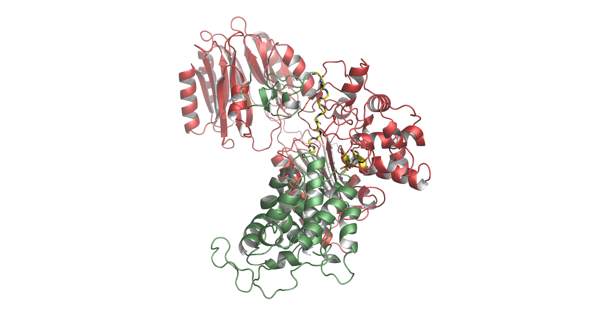
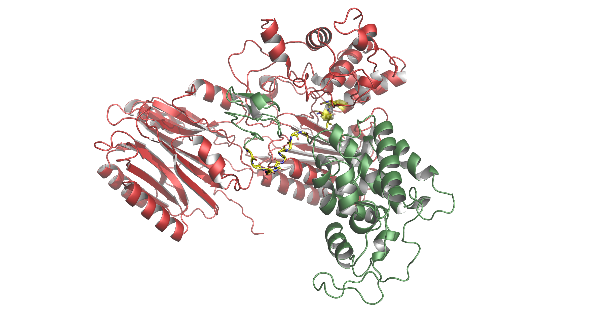
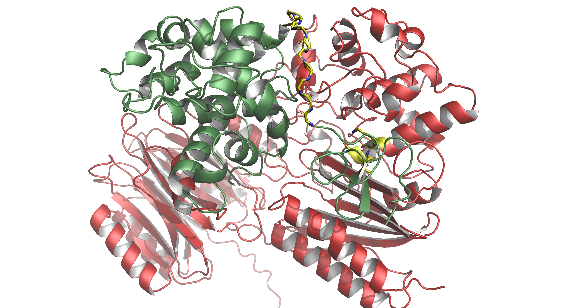

# gobio

## Description

The gobio module is being developed by a protein scientist using go to
accomplish everyday tasks. It was designed to get things done rather
than to be feature rich. Packages like `dna` and `protein` are useful in
many situations, while others like `signalp` and `komagataella` are more
specialized. gobio also contains packages for retrieving dna and
protein sequences from ncbi (`eutils`) and uniprot databases, performing
local blast searches and printing the results, and interacting with
the pymol molecular structure viewer.

## Examples

The `gobio/cmd/` directory contains example programs demonstrating how
each package works. The `main.go` files are commented and can be run
from the root directory: `go run ./cmd/demopymol` or `go run
./cmd/demoeutils`


# dna.go
package dna // import "github.com/tnaums/gobio/internal/dna"

Package dna provides a DNA type to store DNA sequence information.

VARIABLES
```go
var GeneticCode = map[string]byte{
	"TTT": 'F', "TTC": 'F', "TTG": 'L', "TTA": 'L',
	"TCT": 'S', "TCC": 'S', "TCA": 'S', "TCG": 'S',
	"TAT": 'Y', "TAC": 'Y', "TAG": '*', "TAA": '*',
	"TGT": 'C', "TGC": 'C', "TGG": 'W', "TGA": '*',
	"CTT": 'L', "CTC": 'L', "CTG": 'L', "CTA": 'L',
	"CCT": 'P', "CCC": 'P', "CCA": 'P', "CCG": 'P',
	"CAT": 'H', "CAC": 'H', "CAG": 'Q', "CAA": 'Q',
	"CGT": 'R', "CGC": 'R', "CGG": 'R', "CGA": 'R',
	"ATT": 'I', "ATC": 'I', "ATG": 'M', "ATA": 'I',
	"ACT": 'T', "ACC": 'T', "ACA": 'T', "ACG": 'T',
	"AAT": 'N', "AAC": 'N', "AAG": 'K', "AAA": 'K',
	"AGT": 'S', "AGC": 'S', "AGG": 'R', "AGA": 'R',
	"GTT": 'V', "GTC": 'V', "GTG": 'V', "GTA": 'V',
	"GCT": 'A', "GCC": 'A', "GCA": 'A', "GCG": 'A',
	"GAT": 'D', "GAC": 'D', "GAG": 'E', "GAA": 'E',
	"GGT": 'G', "GGC": 'G', "GGG": 'G', "GGA": 'G',
}
```
    GeneticCode is a map of the standard genetic code.


FUNCTIONS
```go
func DNAChannelFasta(f io.ReadCloser) <-chan DNA
    DNAChannelFasta reads fasta sequences from an io.Reader interface, such
    as an *os.File returned from os.Open(fileName). Returns channel of type DNA
    and initiates a go routine that creates DNA structs and adds them to the channel.
```
```go
func NewGenBank(r io.Reader) GenBank
    Parses a GenBank file containing a single dna sequence and returns a GenBank
    struct.
```
TYPES
```go
type DNA struct {
	Header     string
	Parent     string
	Complement string
	Orfs       []Orf
}
    The DNA struct contains the sequence header, the Parent DNA sequence,
    and the Complement DNA sequence. The Orfs slice contains all possible open
    reading frames based solely on translation.

type GenBank struct {
	Sequence   DNA
	Features   []byte
	Accession  string
	Definition string
	// Has unexported fields.
}

```
```go
func NewDNAFromFasta(filename string) ([]DNA, error)
    NewDNAFromFasta creates a slice of type DNA from a fasta file containing one
    or more DNA sequences.
```
```go
func NewDNAFromSequence(header, sequence string) DNA
    NewDNAFromSequence is a function that creates a type DNA struct from a
    sequence string.
```
```go
func (d DNA) String() string
    DNA.String prints the sequence of the Parent strand in fasta format.
```
```go
func (d DNA) Translate() (orfs []Orf)
    Translate converts DNA sequences to a slice of type Orf containing all
    possible open reading frames.
```

```go
type Orf struct {
	Strand    string
	Frame     int
	AminoAcid string
}

    The Orf struct contains information for a possible open reading frame.
```    
```go
func (o Orf) String() string
    Orf.String prints the sequence of an orf in fasta format.
```

# protein.go
package protein // import "github.com/tnaums/gobio/internal/protein"

Package protein provides a protein type to store protein sequence information.

FUNCTIONS
```go
func ProteinChannelFasta(f io.Reader) <-chan Protein
    ProteinChannelFasta reads fasta sequences from an io.Reader interface,
    such as an *os.File returned from os.Open(fileName). Returns channel of type
    Protein and initiates go routine that creates Proteins and adds to channel.
```

TYPES
```go
type Protein struct {
	Header    string
	AminoAcid string
	Mass      float64
}
    Contains header and amino acid sequence, parsed from fasta file. Mass can be
    calculated from AminoAcid by calling calculateMass(aaSequence).
```
```go
func NewProtein(header, sequence string) Protein
    Create a Protein struct from header and sequence strings
```
```go
func NewProteinFromFasta(filename string) ([]Protein, error)
    NewProteinFromFasta creates a slice of type Protein from a fasta file
    containing one or more protein sequences.
```
```go
func (p Protein) String() string
    String method that satisfies the Stringer interface;
    for example: fmt.Println(protein) prints 'protein' in fasta format
```

# pymol

The pymol package supports control of the pymol structure
viewer from go.
```go
cmd := exec.Command("pymol", "-p", "-K", cif)
stdin, err := cmd.StdinPipe()
```

The package also includes functions to parse cif files into go data
structures. In the `./cmd/demopymol` example, the cif files attempt to
describe the interaction between a plant chitinase and a fungal
protease that cleaves it.  The program locates peptide motifs within
each protein, determines the atom id range, and
instructs pymol to select each motif, set the color, and show these
regions as sticks. In this example, a substrate protein with a
targeted polyglycine sequence (ChitA, chain A) is modeled with fungal
proteases. Both the polyglycine target and protease active site motifs
are highlighted, enabling easy analysis of co-structures predicted
by alphafold3. In all three cases, the structures fail to show the
polyglycine in proximity to the protease active site.





This package was inspired by the python package 'pymolPy3':
    https://github.com/carbonscott/pymolPy3/tree/main


VARIABLES
```go
var ThreeToOne = map[string]byte{
	"ALA": 'A', "LEU": 'L',
	"ARG": 'R', "LYS": 'K',
	"ASN": 'N', "MET": 'M',
	"ASP": 'D', "PHE": 'F',
	"CYS": 'C', "PRO": 'P',
	"GLN": 'Q', "SER": 'S',
	"GLU": 'E', "THR": 'T',
	"GLY": 'G', "TRP": 'W',
	"HIS": 'H', "TYR": 'Y',
	"ILE": 'I', "VAL": 'V',
}
    Map that converts the 3 letter amino acid codes found in ATOM records to
    single amino acid codes. Used to create fasta protein sequences from cif
    files.
```

FUNCTIONS
```go
func CustomizeCartoon(r io.Writer)
```
```go
func SelectByChain(r io.Writer, name string, color string, chain string, showsticks bool)
    Makes a pymol selection based on chain, sets the selection color, and
    optionally shows sticks.
```
```go
func SelectByID(r io.Writer, name string, color string, idstart int, idend int, showsticks bool)
    Makes a pymol selection based on start and end atom id, sets the selection
    color, and optionally shows sticks.
```
```go
func SequenceFromCIF(r io.Reader) *bytes.Buffer
    Function that creates protein fasta files for each chain in a cif file.
    The returned *bytes.Buffer can be passed to protein.ProteinChannelFasta as
    the io.Reader.
```
```go
func SetLighting(r io.Writer)
```
TYPES
```go
type Atom struct {
	ID         int
	TypeSymbol string
	Label      Label
	Cartesian  Cartesian
	Occupancy  float64
	B          float64
	Author     Author
	PDBX       PDBX
}
    Atom holds complete information parsed from ATOM line in cif file
```
```go
func NewAtom(entry string) Atom
    NewAtom parses information from an ATOM line in a cif protein structure file
    and returns an Atom struct.
```
```go
type Author struct {
	SeqID  int
	AsymID string
}
    Author portion of Atom
```    

```go
type Cartesian struct {
	X float64
	Y float64
	Z float64
}
    Cartesian portion of Atom
```
```go
type ChainMap map[int]Residue
    ChainMap keys are sequence number for an amino acid in a chain. Values are
    Residue struct for that amino acid. Used to convert amino acid numbers to
    atom id numbers.
```
```go
func NewChainMap(r io.Reader, chain string) ChainMap
    Create a ChainMap from the ATOM field of a cif file.
```    
```go
type Label struct {
	AtomID   string
	AltID    string
	CompID   string
	AsymID   string
	EntityID int
	SeqID    int
}
    Label portion of Atom
```
```go
type PDBX struct {
	InsCode     string
	PDBModelNum int
}
    PDBX portion of Atom
```    
```go
type Residue struct {
	AminoAcid string
	Position  int
	IDStart   int
	IDEnd     int
}
    Residue contains information for an amino acid.
```    
```go
type Structure map[int]Atom
    Keys are atom id. Values are the Atom struct containing all 17 fields of
    information parsed from ATOM lines of cif file.
```
```go
func NewStructure(r io.Reader) Structure
    Creates a new Structure map from a cif file.
```    
# komagataella
package komagataella // import "github.com/tnaums/gobio/internal/komagataella"

Package for analysis of pPICZ plasmids that are used for expression of
recombinant proteins in Komagataella pfaffii, also known as Pichia pastoris.

FUNCTIONS
```go
func GetCoding(d dna.DNA, promoter string) (dna.DNA, error)
    Extracts protein coding sequence from the plasmid sequence.
```
```go
func GetPromoter(d dna.DNA) (string, error)
    Determines promoter type, either inducible aox1, or constitutive gap.
```
```go
func GetRecombinant(dna dna.DNA) (protein.Protein, string)
    Determines protein sequence from DNA coding sequence. Also, returns
    secretion signal sequence or cytoplasmic.
```

TYPES
```go
type Komagataella struct {
	Plasmid  dna.DNA
	Promoter string
	Coding   dna.DNA
	Protein  protein.Protein
	SSS      string
}
```
```go
func NewKomagataella(r io.Reader) (Komagataella, error)
    Factory function that creates Komagataella struct from a fasta file.
```
```go
func (k Komagataella) String() string
```
